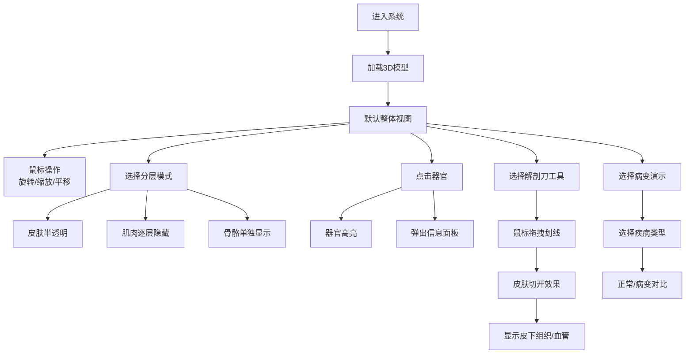

## 1. 产品概述

本产品是一个面向动物医学专业学生的交互式3D猫咪解剖教学系统，解决实物标本数量有限、无法反复观察内部结构的教学痛点。通过WebGL技术让学生在网页上逐层剥离皮肤、肌肉、骨骼，清晰观察每个器官的位置和形态，提升解剖学学习效率。

## 2. 核心功能

### 2.1 用户角色

| 角色 | 注册方式 | 核心权限 |
|------|----------|----------|
| 学生用户 | 无需注册，直接访问 | 浏览3D模型、使用所有解剖功能、查看器官信息 |
| 教师用户 | 后台登录 | 同上，可管理病变案例数据 |

### 2.2 功能模块

1. **3D解剖主界面**：核心3D渲染区域、相机控制、模型操作
2. **结构分层显示**：皮肤半透明化、肌肉逐层隐藏、骨骼单独显示三种模式自由组合
3. **器官信息标注**：点击任意器官高亮显示，弹出详细介绍
4. **病变演示模块**：展示常见疾病的器官病变状态对比
5. **解剖模拟模块**：虚拟解剖刀功能，鼠标拖拽"切开"皮肤观察皮下组织
6. **控制面板**：视图切换、模式选择、工具切换

### 2.3 页面详情

| 页面名称 | 模块名称 | 功能描述 |
|----------|----------|----------|
| 主界面 | 3D渲染区域 | Three.js渲染猫咪3D模型，支持旋转、缩放、平移 |
| 主界面 | 顶部导航栏 | 系统标题、帮助按钮、全屏切换 |
| 主界面 | 左侧控制面板 | 分层显示模式切换、视图预设、解剖工具选择 |
| 主界面 | 右侧信息面板 | 器官详情展示（生理功能、常见疾病、临床意义） |
| 主界面 | 底部操作栏 | 重置视图、截图保存、进度指示 |

## 3. 核心流程

## 4. 用户界面设计

### 4.1 设计风格

- **主色调**：深蓝科技感配色（#1a365d），医学专业感
- **辅助色**：器官高亮使用暖橙色（#ed8936），选中状态使用青色（#38b2ac）
- **背景色**：深灰色渐变背景（#1a202c → #2d3748），突出3D模型
- **按钮风格**：圆角矩形，微立体效果，hover时有平滑过渡
- **字体**：标题使用思源黑体 Bold，正文使用思源黑体 Regular
- **布局风格**：三栏布局，3D场景居中，控制面板左右分布，卡片式容器，半透明毛玻璃效果
- **图标风格**：线性医疗风格图标，简洁专业

### 4.2 页面设计概述

| 页面名称 | 模块名称 | UI元素 |
|----------|----------|--------|
| 主界面 | 3D渲染区域 | 全屏WebGL画布，光照效果，阴影投射，鼠标悬停光标变化 |
| 主界面 | 左侧控制面板 | 折叠式菜单，分层开关按钮组，工具选择图标栏 |
| 主界面 | 右侧信息面板 | 器官名称标题，功能说明卡片，疾病列表，临床意义标签 |
| 主界面 | 顶部导航 | 磨砂玻璃效果，系统logo，功能按钮 |
| 主界面 | 底部操作栏 | 快捷操作按钮，进度条指示器，缩放比例显示 |

### 4.3 响应式

- **桌面端优先**：1920×1080及以上分辨率最优体验
- **平板适配**：控制面板可折叠为图标模式，信息面板改为底部弹出
- **交互优化**：支持触屏手势操作（双指缩放、旋转）

### 4.4 3D场景指导

- **环境/HDRI**：使用柔和的室内环境贴图，模拟实验室光照氛围，避免过强反光
- **光照设置**：主光源（Key Light）45°角投射，补光（Fill Light）弱化阴影，环境光（Ambient）提升整体亮度，附加轮廓光（Rim Light）突出模型边缘
- **相机设置**：默认透视相机，fov=45°，初始距离模型2米高度，目标点为模型中心
- **相机运动**：OrbitControls带阻尼缓动（enableDamping=true, dampingFactor=0.05），限制垂直旋转角度避免翻倒
- **构图与焦点**：模型居中显示，预留左右控制面板空间，器官高亮时相机可自动调整视角
- **交互与动画**：器官选中时平滑缩放+边缘发光效果，分层切换时透明度动画过渡（0.3s），解剖刀划线时实时生成切割路径
- **后处理效果**：FXAA抗锯齿，轻微Bloom效果增强器官高亮，SSAO环境光遮蔽提升立体感
- **资源与性能**：模型采用LOD三级优化（高/中/低精度），单帧draw call控制在200以内，目标帧率60fps

## 5. 非功能性需求

### 5.1 性能要求
- 初始加载时间 < 5秒（缓存情况下 < 2秒）
- 运行帧率 ≥ 45fps（中等配置PC）
- 模型面数：高精度≤20万，中精度≤10万，低精度≤3万
- 内存占用 ≤ 500MB

### 5.2 兼容性要求
- Chrome/Edge 90+
- Firefox 88+
- Safari 14+
- 支持WebGL 2.0

### 5.3 可用性要求
- 操作响应时间 < 100ms
- 器官点击准确率 ≥ 95%
- 提供操作引导提示
