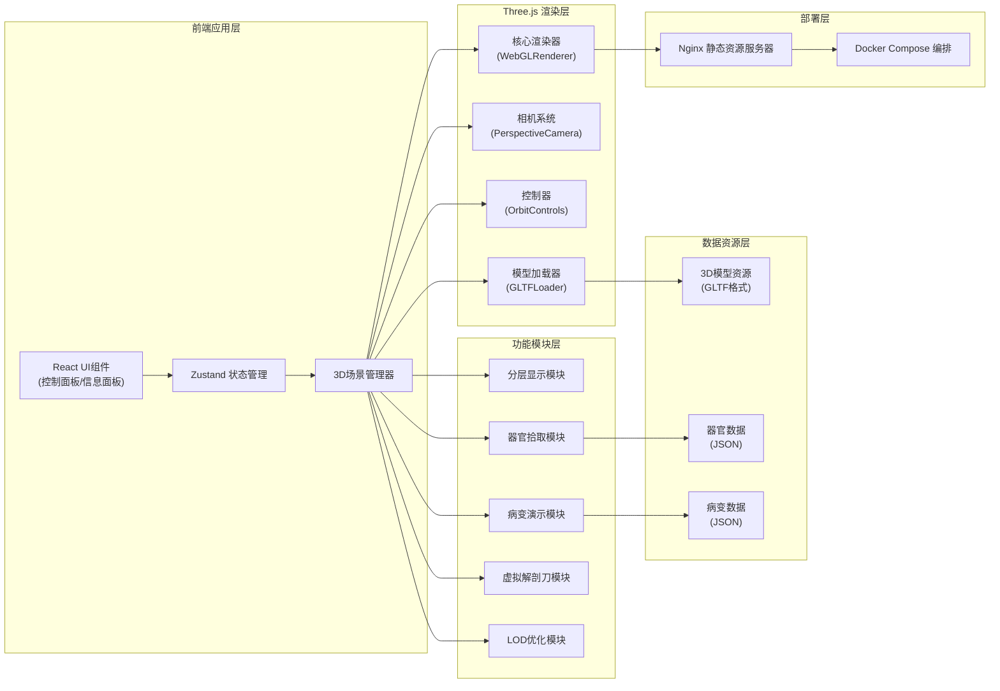

## 1. 架构设计



## 2. 技术描述

- **前端框架**：React@18 + TypeScript
- **构建工具**：Vite@5
- **样式方案**：TailwindCSS@3 + CSS Modules
- **3D引擎**：Three.js@0.160
- **3D辅助库**：@react-three/fiber@8，@react-three/drei@9，@react-three/postprocessing@2
- **状态管理**：Zustand@4
- **动画库**：@react-spring/three@9
- **性能优化**：Three.js LOD + InstancedMesh
- **部署**：Nginx + Docker Compose

## 3. 目录结构

```
src/
├── components/
│   ├── UI/                    # React UI组件
│   │   ├── TopNavbar.tsx      # 顶部导航栏
│   │   ├── LeftPanel.tsx      # 左侧控制面板
│   │   ├── RightPanel.tsx     # 右侧信息面板
│   │   ├── BottomBar.tsx      # 底部操作栏
│   │   └── OrganInfoModal.tsx # 器官详情弹窗
│   └── Three/                 # Three.js相关组件
│       ├── Scene.tsx          # 3D场景主组件
│       ├── CatModel.tsx       # 猫咪模型组件
│       ├── Organ.tsx          # 单个器官组件
│       └── ScalpelTool.tsx    # 解剖刀工具组件
├── store/                     # 状态管理
│   └── useAnatomyStore.ts     # 解剖系统状态store
├── hooks/                     # 自定义hooks
│   ├── use3DScene.ts          # 3D场景管理hook
│   ├── useOrganPicker.ts      # 器官拾取hook
│   └── useVisibilityChange.ts # 标签页可见性hook
├── utils/                     # 工具函数
│   ├── threeHelpers.ts        # Three.js辅助函数
│   ├── modelLoader.ts         # 模型加载器
│   └── animation.ts           # 动画工具函数
├── data/                      # 数据文件
│   ├── organs.json            # 器官信息数据
│   └── diseases.json          # 病变案例数据
├── types/                     # TypeScript类型定义
│   └── anatomy.ts             # 解剖系统类型
├── App.tsx                    # 应用入口
├── main.tsx                   # React入口
└── index.css                  # 全局样式
```

## 4. 核心数据模型

```typescript
// 器官类型定义
interface Organ {
  id: string;
  name: string;
  latinName: string;
  layer: 'skin' | 'muscle' | 'bone' | 'organ' | 'vessel';
  meshName: string;
  position: [number, number, number];
  physiology: string;
  commonDiseases: string[];
  clinicalSignificance: string;
  color: string;
}

// 病变类型定义
interface Disease {
  id: string;
  name: string;
  organId: string;
  description: string;
  symptoms: string[];
  normalModelPath: string;
  diseasedModelPath: string;
  treatment: string;
}

// 视图层状态
interface LayerState {
  skin: { visible: boolean; opacity: number; translucent: boolean };
  muscle: { visible: boolean; opacity: number; level: number };
  bone: { visible: boolean; opacity: number; isolated: boolean };
  organs: { visible: boolean; opacity: number };
  vessels: { visible: boolean; opacity: number };
}

// 全局状态
interface AnatomyState {
  currentTool: 'select' | 'scalpel' | 'rotate' | 'pan' | 'zoom';
  selectedOrgan: Organ | null;
  layers: LayerState;
  isPathologyMode: boolean;
  currentDisease: Disease | null;
  cameraPosition: [number, number, number];
  isPaused: boolean;
}
```

## 5. 核心模块设计

### 5.1 3D场景核心模块
- **文件**：`src/components/Three/Scene.tsx`
- **职责**：管理Three.js场景、相机、渲染器生命周期
- **关键特性**：
  - WebGLRenderer启用抗锯齿和阴影映射
  - PerspectiveCamera初始位置(0, 1.5, 3)，目标点(0, 0.5, 0)
  - 环境光+方向光+半球光三点光照系统
  - LOD三级模型切换（距离阈值：2, 5, 10）
  - 标签页可见性监听，切换时暂停渲染

### 5.2 分层显示模块
- **文件**：`src/hooks/useLayerControl.ts`
- **核心逻辑**：
  ```typescript
  // 皮肤半透明化
  const setSkinTranslucent = (translucent: boolean) => {
    skinMesh.traverse((child) => {
      if (child.isMesh) {
        child.material.transparent = translucent;
        child.material.opacity = translucent ? 0.3 : 1.0;
        child.material.depthWrite = !translucent;
      }
    });
  };
  
  // 肌肉逐层隐藏（按深度层级）
  const setMuscleLevel = (level: number) => {
    muscleMeshes.forEach((mesh, index) => {
      mesh.visible = index < level;
    });
  };
  
  // 骨骼单独显示
  const setBoneIsolated = (isolated: boolean) => {
    skinMesh.visible = !isolated;
    muscleGroup.visible = !isolated;
    organGroup.visible = !isolated;
    boneGroup.visible = true;
  };
  ```

### 5.3 器官拾取模块
- **文件**：`src/hooks/useOrganPicker.ts`
- **技术方案**：Raycaster射线检测 + GPU Picking
- **点击检测流程**：
  1. 监听鼠标点击事件，转换为归一化设备坐标(NDC)
  2. Raycaster从相机发射射线
  3. 与可拾取器官mesh求交
  4. 返回最近的交点，触发器官选中
  5. 高亮效果：OutlinePass后处理 + 颜色过渡动画

### 5.4 虚拟解剖刀模块
- **文件**：`src/components/Three/ScalpelTool.tsx`
- **实现原理**：
  1. 鼠标按下时记录起始点，启用划线模式
  2. 鼠标移动时实时更新切割路径（Line几何体）
  3. 鼠标释放时根据路径生成切割平面（Plane）
  4. 使用ClippingPlane裁剪皮肤模型
  5. 显示皮下组织和血管（根据切割区域筛选）
- **关键技术**：Three.js Clipping Planes + 动态几何体更新

### 5.5 性能优化模块
- **LOD实现**：
  ```typescript
  const createLODModel = (high: string, medium: string, low: string) => {
    const lod = new THREE.LOD();
    lod.addLevel(loadModel(high), 0);
    lod.addLevel(loadModel(medium), 2);
    lod.addLevel(loadModel(low), 5);
    lod.addLevel(new THREE.Group(), 15);
    return lod;
  };
  ```
- **标签页暂停**：使用`document.visibilitychange`事件
- **渲染优化**：`renderer.setPixelRatio(Math.min(window.devicePixelRatio, 2))`

### 5.6 OrbitControls模块
- **配置参数**：
  ```typescript
  const controls = new OrbitControls(camera, renderer.domElement);
  controls.enableDamping = true;
  controls.dampingFactor = 0.05;
  controls.minDistance = 0.5;
  controls.maxDistance = 10;
  controls.maxPolarAngle = Math.PI * 0.9;
  controls.minPolarAngle = 0.1;
  controls.target.set(0, 0.5, 0);
  ```

## 6. 部署架构

### 6.1 Docker Compose配置
```yaml
version: '3.8'
services:
  web:
    image: nginx:alpine
    ports:
      - "8080:80"
    volumes:
      - ./dist:/usr/share/nginx/html
      - ./nginx.conf:/etc/nginx/conf.d/default.conf
      - ./public/models:/usr/share/nginx/html/models
    restart: unless-stopped
```

### 6.2 Nginx配置要点
- gzip压缩启用（支持.glb/.gltf模型压缩）
- 静态资源缓存策略（模型文件缓存7天）
- CORS配置（允许本地调试访问）

## 7. 性能预算

| 资源类型 | 预算大小 | 说明 |
|---------|---------|------|
| 首屏JS | < 500KB | gzip压缩后 |
| 3D模型总大小 | < 15MB | GLB格式，Draco压缩 |
| 单帧渲染时间 | < 16ms | 60fps目标 |
| 内存占用 | < 500MB | 包含纹理和几何体 |
| Draw Call | < 200 | 合并材质和几何体 |
